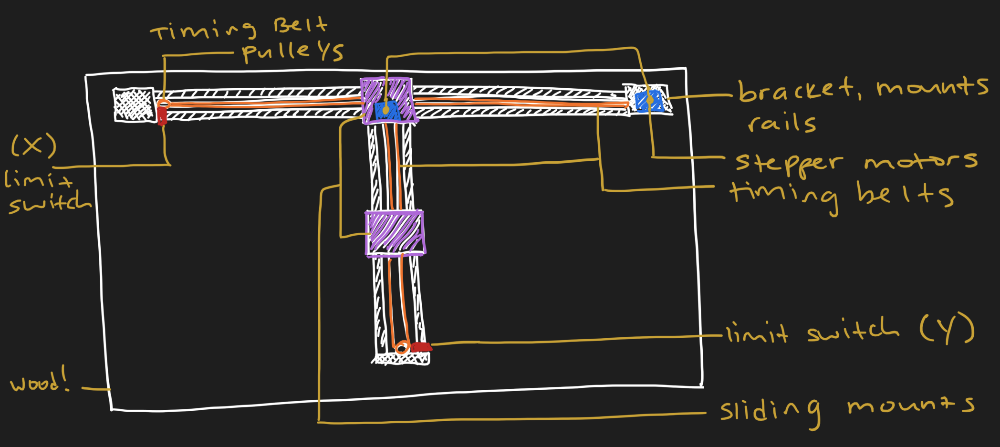
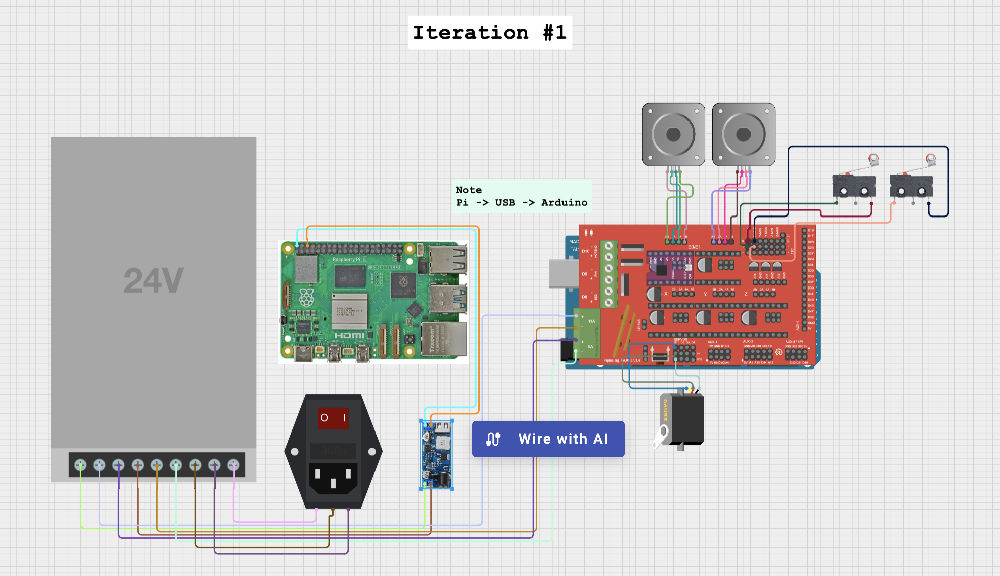

> The Tengwar `(TENG-wahr)` script is an artificial script, one of several scripts created by J. R. R. Tolkien, the author of *The Lord of the Rings*. Within the context of Tolkien's fictional world, the Tengwar were invented by the Elf Fëanor, and used first to write the Elvish languages Quenya and Telerin.
>
> — [*Source*](https://en.wikipedia.org/wiki/Tengwar)
---

I'm building a wall mountable XY-plotter that draws my monthly calendar, updates events as they're added, and sometimes doodles baby Balrogs! Wouldn't it be cool to bring something from our digital space into our physical reality? Better yet, what if this thing could actually serve a dual purpose of both *function* and *art*! 

*Please note that this README will be a living, breathing document until I finish :)*

---

## Get Started
1. Create a new virtual environment by running `python3 -m venv .venv` and run `pip install -r requirements.txt` to install all dependencies. Start the virtual environment by running `source .venv/bin/activate`.

## Prototyping
### Physical Design

### Circuit Design

---

## Materials
### Core Compute & Control
- Raspberry Pi 4 Model B (4 GB RAM)
- Arduino 2650 R3
- RAMPS 1.4 Shield

### Motion Control
- 2 × NEMA 17 Stepper Motors
- 2 × A4988 Stepper Driver Modules
- 2 x KW12-3 Limit Switches
<!-- - 1 x Servo motor

### Power
- 24/5V Buck Boost Converter
- 24V PSU
- C14 Female

### Mechanical
- Linear rails, rods, or belt system (XY motion)
- Timing belts and pulleys or lead screws
- Pen holder 
- Wall-mount frame or backboard
- Fasteners (M3/M4 screws, nuts, spacers)
-->